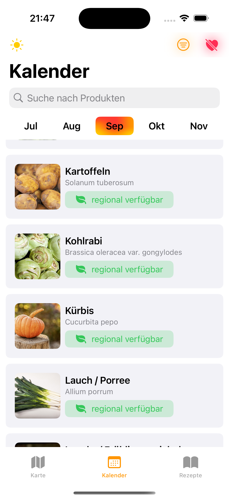
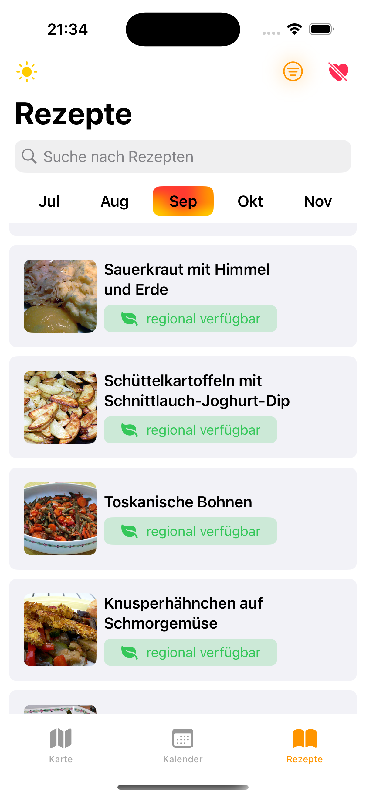
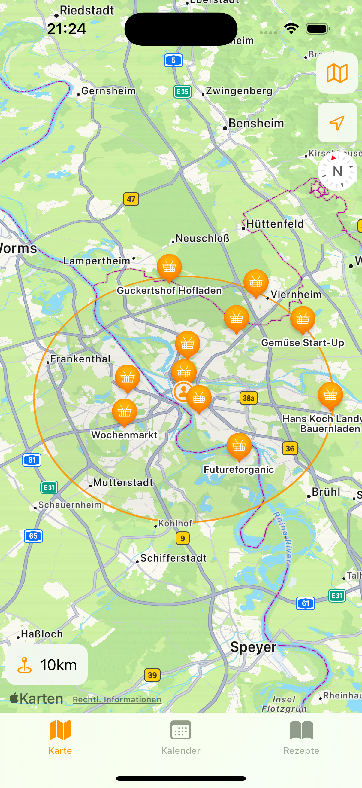
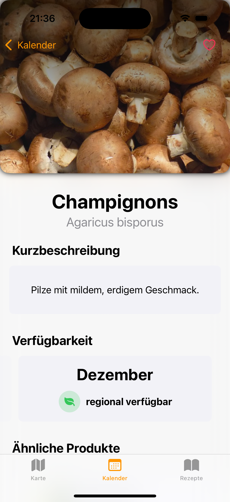
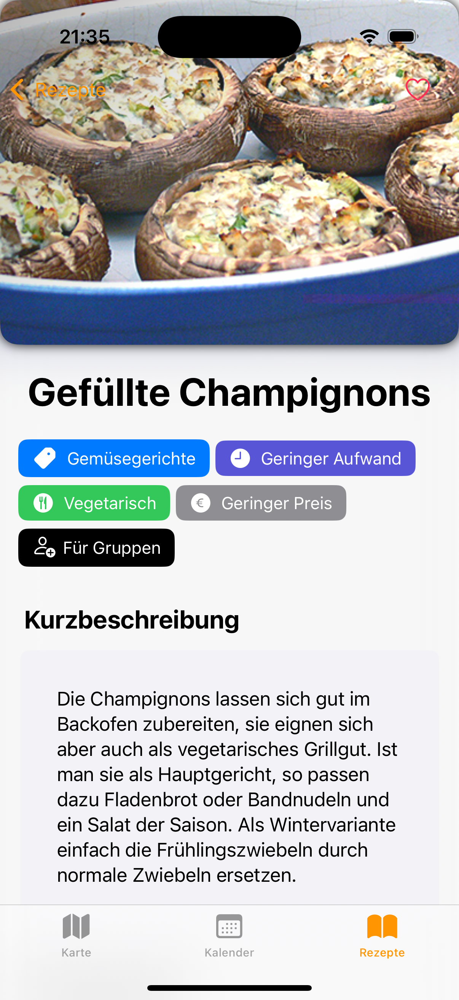
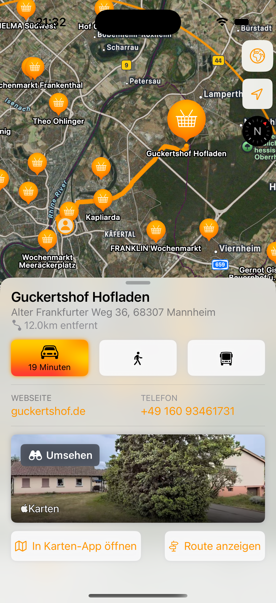
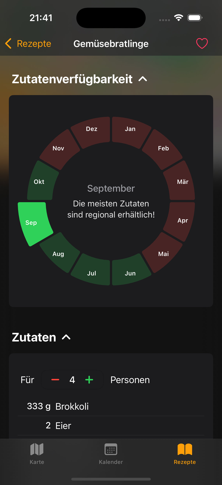
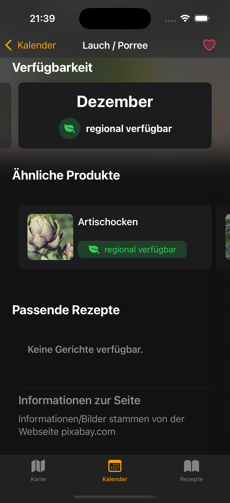

  
  
  

Mit *SeasonScout* findest Du immer genau das Obst und Gemüse, das gerade in Deutschland Saison hat – frisch, lokal und umweltfreundlich!

Vergiss schrumpelige Avocados, die tausende Kilometer gereist sind, oder Tomaten, die mehr Energie als ein Raumschiff benötigen, um in beheizten Gewächshäusern zu wachsen. *SeasonScout* hilft Dir, Deinen CO₂-Fußabdruck zu reduzieren, die lokale Landwirtschaft zu unterstützen und gleichzeitig köstliche Gerichte aus den frischesten Zutaten zu zaubern.
 

---

### Galerie

  
  
  

  
  
  

  
  
  

---
### Funktionen

**Saisonkalender:** Entdecke, welche Produkte gerade Saison haben, auf Lager sind oder nur als Importware zu bekommen sind.

**Rezepte:** Lass dich inspirieren von über 250 Gerichten, die genau zu den saisonalen Highlights passen.

**Produktsuche:** Überprüfe die Verfügbarkeit deiner Favoriten – von knackigen Äpfeln bis hin zu aromatischen Kräutern.

**Marktfinder:** Lokale Märkte und Geschäfte, die regionale Produkte anbieten, sind nur einen Klick entfernt.

**Favoriten:** Halte deine Lieblingsprodukte immer im Blick.

**Dark Mode:** Für unsere nachtaktiven Freunde und Sympathisanten der dunklen Seite.

und viele mehr...

---
### Über dieses Projekt

Diese App ist im Rahmen des Kurses *iOS App Development mit SwiftUI* an der Hochschule Mannheim im Wintersemester 2024/25 entstanden.

Entwickelt von:\
Quoc Duy Nicklas Hoang,\
Henry Harder und\
Steven Schmitt

